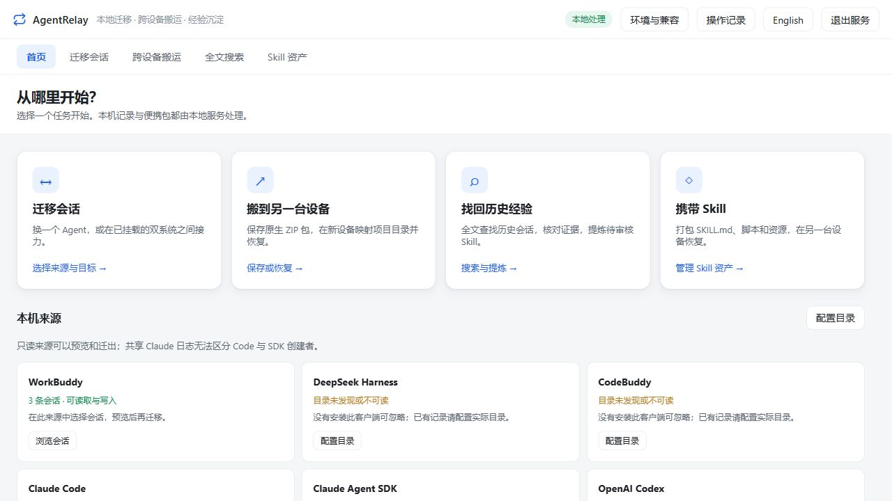

# AgentRelay Portable

[](https://github.com/FriedOnion2/agent-relay-portable/actions/workflows/tests.yml)
[](LICENSE)
[](https://github.com/FriedOnion2/agent-relay-portable/releases)

[中文](README.md) | **English**

Browse, export, and migrate AI coding assistant conversations locally, or carry conversation and Skill archives on a portable drive and restore them on another device. AgentRelay provides a **Chinese/English web interface and a command-line interface** for Windows, macOS, and Ubuntu / Linux.

**The universal release bundles Python 3.12 and `zstandard`. Extract the complete archive and launch it: no Python or Node.js installation and no dependency downloads on first launch.** One archive contains Windows, macOS, and Linux runtimes for switching devices.

The service listens only on the local machine. It does not upload conversations or call models. Python installation instructions below apply only to running the source code.

The task home links to migration, moving between devices, full-text search, and Skill assets. Restore archives with an explicit local project mapping and keep the original ID or create a separate copy; completed migration results remain available when switching pages. Reviewed draft exports can be handed to Skill storage, which requires a separate explicit save. See the [web workflow guide](docs/web-workflow.md) (Chinese).



## Features and supported sources

- Browse, search, preview, and export conversations to Markdown.
- Convert conversations to WorkBuddy, DSH, Claude Code, or Codex, preserving representable text, reasoning, and tool history.
- Save individual or selected conversations as native ZIP archives for another device.
- Archive complete Skill directories, including `SKILL.md`, scripts, and resources; select multiple items or the entire current list.
- Transfer native records between the same assistant on Windows and Ubuntu using mounted or backed-up user directories.
- Retry available ports automatically and stop the server from the web interface after active requests finish.
- Portable SQLite/FTS5 full-text search: Chinese short terms, mixed-language queries, source/project/date/tool filters and offline cached conversations. Reasoning is excluded by default.
- Extract editable Skill drafts from at least three independent complete conversations. Review evidence and outcomes before explicitly exporting; no model calls, installation or script execution. See [search and draft guide](docs/search-and-skills.md) (Chinese).

| Source | Default conversation location | Support |
|---|---|---|
| WorkBuddy | `~/.workbuddy/projects` | Read, export, write |
| DeepSeek Harness / DSH | `~/.dsh/sessions` | Read v0–v4, export, write native compressed history |
| CodeBuddy CLI | `~/.codebuddy/projects` | Read, export, migrate out |
| CodeBuddy CN IDE / Extension | System `CodeBuddyExtension/Data/**/history` | Read manifests and messages, export, migrate out |
| Claude Code | `~/.claude/projects` | Read, export, write |
| Claude Agent SDK | `~/.claude/projects` (shared with Claude Code) | Read, export, migrate out |
| OpenAI Codex | `~/.codex/sessions` | Read, export, write |

CodeBuddy CLI and IDE appear under one source. DSH and WorkBuddy have separate names, configuration, and directories. Claude Agent SDK shares Claude Code's default storage; logs cannot reliably identify the creator. The SDK entry is labelled “Claude 共享记录” (shared Claude records), and both lists may show the same conversation. CLI history is not automatically relabelled as SDK-specific history.

## Download and launch

Stable release: none yet (it will be the *Latest* on [Releases](https://github.com/FriedOnion2/agent-relay-portable/releases/latest)). **Rolling dev build:** [`dev`](https://github.com/FriedOnion2/agent-relay-portable/releases/tag/dev) — rebuilt on every merge to `main`, always exactly one, may be unstable.

Download **`AgentRelay-<version>-universal.zip`** from [GitHub Releases](https://github.com/FriedOnion2/agent-relay-portable/releases), extract it completely, and use the launcher for your device. GitHub's automatically generated **Source code** archives are for development.

| Device | Release launcher | Supported systems |
|---|---|---|
| Windows | Double-click `启动_AgentRelay.bat` | Windows 10/11 x64 |
| Mac | `AgentRelay.app` or `bash 启动_AgentRelay.command` | Apple Silicon: macOS 14+; Intel: macOS 15+ |
| Linux | `bash 启动_AgentRelay.sh` | Ubuntu 22.04+ / glibc 2.35+ x64 |

Keep the entire extracted folder on your portable drive. Its optional `config.json`, `storage/`, and `index/` directories are shared across devices. Finish background jobs and exit the service before copying; copy drafts exported elsewhere separately. The launcher extracts only the matching runtime into a local cache, avoiding portable-drive executable restrictions and Mac symlink differences. **Keep `runtimes/`; no runtime is downloaded at startup.** Device overrides live in `devices/<device-id>.json`; another device starts with its own defaults. Inaccessible shared paths prompt reselection in **环境与兼容** (Environment and compatibility); save an empty directory to restore automatic detection.

The Mac app is not notarized by Apple. If macOS blocks it, run `bash Mac首次运行.command` in the trusted extracted directory, then launch again. Runtime caches are `%LOCALAPPDATA%/AgentRelay/<version>/` on Windows, `~/Library/Caches/AgentRelay/<version>/` on Mac, and `~/.cache/agentrelay/<version>/` on Linux (respecting `XDG_CACHE_HOME`). If extraction is interrupted, remove that version's cache and retry.

Release archives contain only runtime files, launchers, a configuration example, and the short `开始使用.txt` getting-started guide. Tests, development documents, format research, and personal data are excluded. Development previews are marked **Pre-release**; use `SHA256SUMS.txt` to verify your download. The assistant you restore into still needs its own installation, dependencies, and authentication.

## Stop the server and release its port

The default URL is `http://127.0.0.1:8745/`. If occupied, AgentRelay tries the next five ports; use the URL printed by the launcher or opened in the browser. It does not terminate an existing service or another application. Startup fails if all candidate ports are occupied.

To free an old AgentRelay port, open that service's page and click **退出服务** (Exit service) at the top right, then confirm, or press **Ctrl+C** in its terminal. This also stops a background service launched by `.app`. Active requests finish before shutdown, and other pages connected to that service disconnect. Closing the browser alone does not stop the server. Run the launcher again to restart; stop the old service before restarting updated code.

## Run from source (optional)

Release users can skip this section. Source users need **Python 3.8 or later**. Node.js is used only for web tests. Download or clone the complete repository and run commands from its root.

| System | Initial setup | Launch |
|---|---|---|
| Windows | Install Python, or place a complete embedded Windows Python in `runtime/python/`; install the optional DSH dependency below | Double-click `启动_AgentRelay.bat` |
| macOS | `bash Mac首次准备.command` | Double-click `AgentRelay.app` or `启动_AgentRelay.command` |
| Ubuntu / Linux | `bash Ubuntu首次准备.sh`; install `python3 python3-venv` first if missing | `bash 启动_AgentRelay.sh` |

```sh
python app/cli.py serve
python app/cli.py serve --no-browser --port 8745
python app/cli.py doctor
python -m pip install -r requirements-optional.txt
```

Use `python3` where appropriate on Linux / macOS, or set `RELAY_PYTHON` to the interpreter's full path. Basic source functionality uses the Python standard library; reading compressed DSH sessions and generic DSH imports require `zstandard`. Installing source dependencies requires network access; releases already include them.

Mac setup creates `runtime/macos-<architecture>/` and installs `zstandard`; retry failed dependency installation with `bash Mac安装依赖.command`. Prepare again on another machine: this virtual environment depends on the local Python and is not a portable interpreter. Ubuntu setup uses a user-level virtual environment to avoid PEP 668 restrictions. See [runtime notes](runtime/README.txt) (Chinese). Without the decoder, DSH sessions are listed with an installation prompt; damaged, incomplete, oversized, or unknown-version logs show restricted reading.

The source Mac `.app` opens the browser after HTTP becomes ready and respects `open_browser`. Logs use project `logs/`, falling back to `~/Library/Logs/AgentRelay/` if the drive prevents writes. A source launcher in Documents previously stalled during Python detection; the cause is unconfirmed. Use the terminal launcher and check macOS file/folder permissions if affected.

## Batch conversation and Skill storage

For conversations, select rows in the current source list or click **全选当前列表** (Select all in current list), then **存储所选对话** (Store selected conversations). **存储此会话** (Store this conversation) remains available in an individual preview. Use **跨设备搬运** (Move between devices) to choose a storage directory, inspect archives, and restore.

For Skills, open **Skill 资产** (Skill assets), choose the source agent, and click **查找 Skill** (Find Skills). Enter the actual Skill root if discovery finds nothing. Select directories or the entire current list, then click **存储所选 Skill** (Store selected Skills). You can also enter a directory directly for individual storage.

Select all includes only readable items in the current list. Changing the source or conversation search, or rescanning Skills, clears selections. Each item gets its own archive and success/failure result. Successful items are deselected; failed items stay selected for retry. Restore operates on one archive at a time.

```text
storage/
├── conversations/<agent>/<archive-id>.zip
└── skills/<agent>/<archive-id>.zip
```

Copy archives or the entire `storage/` directory to the destination device. In Conversation storage, choose an archive and an existing local project directory to restore into the corresponding assistant. In Skill storage, choose an archive, destination agent, and actual Skill root, then click **恢复 Skill** (Restore Skill).

Contents and paths are validated before restoration. Existing conversation IDs and Skill names are not overwritten; choose a new ID or directory name when needed. Skill instructions and scripts are not automatically executed. Archives are unencrypted and are not uploaded to GitHub. Conversation archives restore native records for the corresponding assistant; use **迁移到目标** (Migrate to target) for conversion between assistants. See [portable storage](docs/portable-storage.md) (Chinese).

```sh
python app/cli.py store-sessions codex <ID1> <ID2>
python app/cli.py store-sessions codex --all
python app/cli.py stored-sessions --agent codex
python app/cli.py restore-session <conversation.zip> --cwd <absolute-local-project-path>
python app/cli.py skills codex
python app/cli.py store-skills codex --all --skills-dir <actual-skill-root>
python app/cli.py stored-skills --agent codex
python app/cli.py restore-skill <skill.zip> --skills-dir <destination-skill-root>
```

## Conversion and Windows / Ubuntu native migration

Select a source conversation and writable target in the web interface, provide a local target project directory when needed, and click **迁移到目标** (Migrate to target). DSH imports write native v0 history without executing historical tool calls. Replace a source working directory from another operating system with a local absolute path.

```sh
python app/cli.py list codex
python app/cli.py transfer codex <session-id> --to claude
python app/cli.py transfer codex <session-id> --to dsh
python app/cli.py export codex <session-id> -o handoff.md
```

For a dual-boot system, mount the Windows partition in Ubuntu, then run:

```sh
python3 app/cli.py windows-users
python3 app/cli.py windows-use "/media/<ubuntu-user>/<windows-volume>/Users/<windows-user>"
bash 启动_AgentRelay.sh
python3 app/cli.py import-windows codex <session-id> --cwd /home/<user>/<project>
```

The web interface keeps Ubuntu sources and adds six read-only Windows sources. Select a Windows conversation, enter an existing Ubuntu project directory, and click **迁到 Ubuntu 对应软件** (Move to the corresponding Ubuntu assistant) to preserve native records. Supported sources include WorkBuddy, Claude, SDK, Codex, DSH v4 / v0 seed, and CodeBuddy CLI/IDE; create the local IDE workspace first. Historical Windows paths are not automatically rewritten.

For Ubuntu → Windows, enter the Windows project path and its mounted path in Ubuntu, then click **迁到 Windows 对应软件** (Move to the corresponding Windows assistant), or run:

```sh
python3 app/cli.py export-windows codex <session-id> --cwd 'D:\project' --project-path /mnt/data/project
```

On Windows, `python app/cli.py ubuntu-use "D:\UbuntuBackup\alice"` selects an accessible Ubuntu user-directory backup; use `python app/cli.py import-ubuntu codex <session-id> --cwd "D:\project"` to import. Windows does not directly read ext4. Both directions preserve source files, reject existing IDs, and do not merge histories continued independently on both devices. A new ID can retain another copy. See [dual-boot instructions](docs/ubuntu-dual-boot.md) and [migration research](docs/session-migration-alternatives.md) (Chinese).

## Configuration and data

Copy `config.example.json` to `config.json` to configure source roots, the port, and browser opening. Directory precedence is: device configuration → shared configuration → `RELAY_<AGENT>_HOME` → assistant environment variable → current user's default directory. Relative roots resolve against the portable folder. DSH respects `DSH_HOME`, WorkBuddy `WORKBUDDY_HOME`, and CodeBuddy `CODEBUDDY_HOME`.

Phase one adds migration previews with preserved/degraded/dropped/unknown categories, consistency tokens, device environment checks, trusted read-only adapter plugins, and daily synthetic format reports. Migration and `restore-session` commands accept `--dry-run` and `--preview-token`; existing direct calls remain compatible. CLI commands `device-config`, `plugins`, and `health --output health-output` expose these features. Native client continuation and latest client versions remain explicitly unverified. See [compatibility evidence](docs/compatibility.md), [adapter API and example](docs/adapters.md), and [portable troubleshooting](docs/troubleshooting.md) (Chinese).

SDK defaults respect `CLAUDE_CONFIG_DIR`; override separately with `agent_homes.claude_sdk` / `RELAY_CLAUDE_SDK_HOME`. It does not inherit a Claude Code-only `RELAY_CLAUDE_HOME`. Supply an assistant's root directory, not its `projects` / `sessions` subdirectory.

`windows_user_home` / `RELAY_WINDOWS_USER_HOME` selects the mounted Windows user directory on Linux only. Temporary `--windows-user` overrides the saved selection. This adds read-only sources and does not change local write targets.

For old configurations pointing `agent_homes.dsh` or `RELAY_DSH_HOME` at `.workbuddy`, move that value to `workbuddy` / `RELAY_WORKBUDDY_HOME`. `dsh` now means DeepSeek Harness and is not silently aliased to WorkBuddy.

CodeBuddy scans CLI and IDE by default. IDE roots are `%LOCALAPPDATA%/CodeBuddyExtension/Data` on Windows, `~/Library/Application Support/CodeBuddyExtension/Data` on macOS, and `~/.config/CodeBuddyExtension/Data` on Linux. An explicit CodeBuddy root scans only that directory, which can be a backed-up `.codebuddy` or IDE `Data` root.

Conversions read the source and write new files to the target assistant's conversation directory without overwriting existing targets. Keep logs, local configuration, runtimes, caches, and real conversation data out of GitHub; repository ignore rules cover these paths.

## Validation

```sh
python -m pip install -r requirements-optional.txt
python -m unittest discover -s tests -v
node --test tests/web.test.cjs
```

As of 2026-10-08, stage-two local regression coverage is **140 Python tests (4 environment-dependent skips on Windows) and 28 web tests**. GitHub Actions tests Python 3.8, 3.12, and 3.14 across Windows, Ubuntu, and macOS in eight combinations (macOS excludes Python 3.8). Release smoke runs exercise FTS5, Chinese queries, reasoning exclusion/purge, workflow drafts, explicit export and a relocated corpus inside every frozen runtime.

Tests cover conversion, archive round trips, integrity and conflict protection, occupied ports, shutdown waiting, asynchronous lists, and partial batch failures. They use temporary synthetic data without modifying real conversations or executing Skill scripts.

Optional Mac validation: `python3 tests/macos_launch_smoke.py` launches the actual `.app`, probes local sources read-only, verifies HTTP and shutdown, and stops its service. Official DSH native checks are in `tests/dsh_native_smoke.mjs` / `tests/dsh_catalog_smoke.mjs`; see their headers for arguments.

Release builds validate bundled dependencies with an empty `PATH`, DSH import, shared storage roots, port retry, HTTP, and shutdown on all four native platforms. The assembled universal archive is also tested on each platform before publication. CI validates AgentRelay's behavior; actual vendor continuation, permissions, and mounts still need checking in the destination environment.

## Current limitations

- WorkBuddy / Claude / SDK / Codex / CodeBuddy CLI read at most 32 MiB; oversized records may export marked partial content but cannot be converted. Oversized DSH input/decompressed data and CodeBuddy IDE aggregate input are rejected.
- Claude / SDK read the current `parentUuid` main chain, without merging old branches or subagents. Pre-compaction text remains in the original file but is not duplicated into the current migrated context.
- DSH export preserves event history without replaying surface replacement, compaction, seed, or native resume state.
- Generic conversion has four targets: WorkBuddy, DSH, Claude, and Codex. CodeBuddy and SDK are read-only for generic conversion. This restriction does not prevent same-assistant native migration or archive restoration.
- DSH import writes native v0 Zstd logs, validated with 0.1.2-rc.1 and strict official 0.2.1-alpha.1 catalog migration to v4. Historical tool calls are disabled; calls missing results become text rather than pending work. Images and non-native blocks become annotated text. The target working directory must be absolute on the current OS.
- Native DSH migration supports full v4 and verifiable v0 seed records. Migrate a fork's parent first; subagents are not imported separately. CodeBuddy IDE needs a uniquely matching existing native workspace and must be closed during import.
- SDK `stream-json` output is not a native transcript. Applications with persistence disabled or only an external SessionStore may have no default local history.
- CodeBuddy CLI/IDE formats are based on observations from third-party consumers, without vendor-native continuation verification; see [source format notes](docs/source-formats.md) (Chinese).
- Images, encrypted reasoning, and vendor-specific metadata may not be fully preserved. Tool-name conversion neither installs target tools nor converts their argument protocols.
- Codex Desktop may require its own database index; generated JSONL does not guarantee appearance in its conversation list.
- Vendor formats can change. AgentRelay read-back tests do not replace actual continuation checks in the destination assistant.
- `.app` and terminal launch have been tested on an Apple Silicon Mac; Gatekeeper permissions and native continuation depend on the destination device.

## Further documentation (Chinese)

- [User guide](使用说明.md): launch, batch storage, shutdown, configuration, and CLI.
- [Portable storage](docs/portable-storage.md): conversation and Skill archives, restoration, and boundaries.
- [Ubuntu dual boot](docs/ubuntu-dual-boot.md): mounting and native migration in both directions.
- [Source formats](docs/source-formats.md): format references and official sources.
- [Native migration research](docs/session-migration-alternatives.md): related projects and implementation differences.

---

Contributing: [CONTRIBUTING.md](CONTRIBUTING.md) · Security: [SECURITY.md](SECURITY.md) · [CHANGELOG.md](CHANGELOG.md) · [MIT License](LICENSE)
