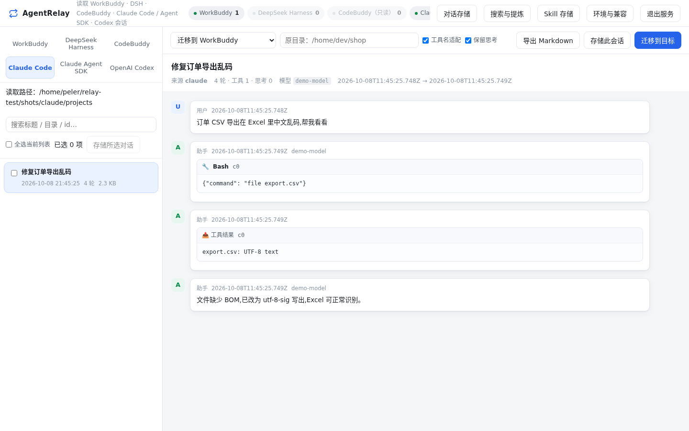
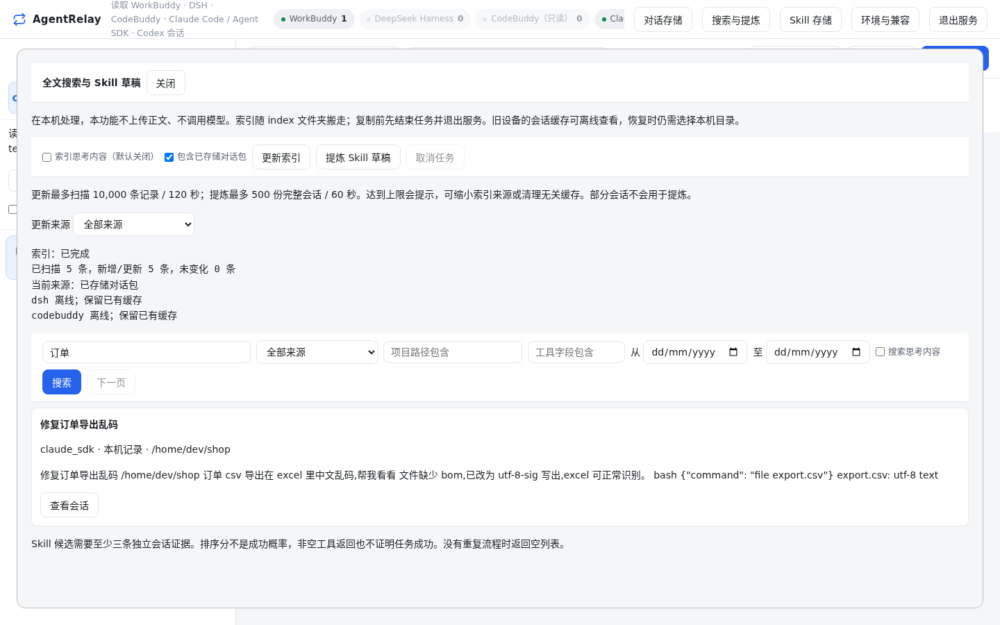

# AgentRelay Portable

[](https://github.com/FriedOnion2/agent-relay-portable/actions/workflows/tests.yml)
[](https://github.com/FriedOnion2/agent-relay-portable/actions/workflows/lint.yml)
[](LICENSE)
[](https://github.com/FriedOnion2/agent-relay-portable/releases)


**中文** | [English](README.en.md)

**在本机浏览、导出和迁移 AI 编程助手的对话与 Skill，并可打包到移动盘，在另一台设备恢复。**

支持 **WorkBuddy、DeepSeek Harness（DSH）、CodeBuddy、Claude Code、Claude Agent SDK、OpenAI Codex**，提供中文网页和命令行，适用于 Windows、macOS、Ubuntu / Linux。



> 🔒 **数据只在本机处理。** 服务只监听本机地址，不上传会话，不调用模型；迁移前先预览“保留 / 降级 / 丢弃 / 未知”，确认后才写入。

## 能做什么

- **查看与导出**：按来源浏览、搜索、预览会话，导出为 Markdown。
- **跨软件迁移**：把会话转换到 WorkBuddy、DSH、Claude Code、Codex，保留可表达的正文、思考和工具历史。
- **跨设备存储**：把对话、Skill 保存为原生 ZIP 包，复制到另一台设备后恢复到对应软件。
- **全文搜索**：本地 SQLite/FTS5 索引，支持中文短词、中英混合与来源 / 项目 / 时间 / 工具筛选。
  
- **提炼 Skill 草稿**：从多条相似的历史会话提炼带证据的 Skill 草稿，由你审核后导出，不自动安装或执行。
- **Windows ↔ Ubuntu**：双系统间搬迁同款软件的原生记录。

## 快速开始

**普通用户**：到 [Releases](https://github.com/FriedOnion2/agent-relay-portable/releases) 下载 `AgentRelay-<版本>-universal.zip`，完整解压后运行启动器。总包内置 Python 与依赖，**无需另装 Python / Node.js，首次启动不联网下载**。不要选择 GitHub 自动生成的 Source code 压缩包。

| 设备 | 启动入口 | 支持范围 |
|---|---|---|
| Windows | `启动_AgentRelay.bat` | Windows 10/11 x64 |
| macOS | `AgentRelay.app` 或 `bash 启动_AgentRelay.command` | Apple Silicon：macOS 14+；Intel：macOS 15+ |
| Linux | `bash 启动_AgentRelay.sh` | Ubuntu 22.04+ / glibc 2.35+ x64 |

启动后在浏览器打开提示的地址（默认 `http://127.0.0.1:8745/`）。退出请点网页右上角「退出服务」。macOS 应用未经 Apple 公证，被系统阻止时的处理见 [安装与启动](docs/install.md)。

**从源码运行**（需要 Python 3.8+）：

```sh
python -m pip install -r requirements-optional.txt   # 读写 DSH 压缩历史需要 zstandard
python app/cli.py serve                              # 启动网页
python app/cli.py list codex                         # 命令行：列出某来源的会话
python app/cli.py export codex <会话id> -o out.md    # 导出 Markdown
python app/cli.py transfer codex <会话id> --to dsh --dry-run   # 先预览迁移
```

Ubuntu / macOS 可用 `Ubuntu首次准备.sh` / `Mac首次准备.command` 自动建立隔离环境。完整步骤见 [安装与启动](docs/install.md)。

## 支持的来源

| 来源 | 默认会话位置 | 读取 / 导出 | 作为迁移目标 | 实机验证 |
|---|---|:-:|:-:|---|
| WorkBuddy | `~/.workbuddy/projects` | ✅ | ✅ | 仅文件层核对 |
| DeepSeek Harness / DSH | `~/.dsh/sessions` | ✅（v0–v4） | ✅ | 真实客户端已验证 |
| CodeBuddy CLI / IDE | `~/.codebuddy/projects` 等 | ✅ | — | 仅文件层核对 |
| Claude Code | `~/.claude/projects` | ✅ | ✅ | 导出已验证 |
| Claude Agent SDK | `~/.claude/projects`（与 Claude Code 共享） | ✅ | — | 与 Claude Code 共享存储 |
| OpenAI Codex | `~/.codex/sessions` | ✅ | ✅ | 真实客户端已验证 |

“实机验证”指用真实客户端打开、续聊过迁移或恢复后的会话；其余只验证了文件层读写。厂商格式可能变化，详见 [兼容状态](docs/compatibility.md) 与 [当前限制](docs/limitations.md)。

## 文档

| 主题 | 文档 |
|---|---|
| 下载、安装、启动与退出 | [docs/install.md](docs/install.md) |
| 批量存储、跨软件 / 双系统迁移与预览 | [docs/storage-and-migration.md](docs/storage-and-migration.md) |
| 配置与数据目录 | [docs/configuration.md](docs/configuration.md) |
| 搜索与 Skill 草稿 | [docs/search-and-skills.md](docs/search-and-skills.md) |
| 便携存储、Ubuntu 双系统 | [docs/portable-storage.md](docs/portable-storage.md) · [docs/ubuntu-dual-boot.md](docs/ubuntu-dual-boot.md) |
| 来源格式、适配器开发 | [docs/source-formats.md](docs/source-formats.md) · [docs/adapters.md](docs/adapters.md) |
| 已知限制、故障排查、测试 | [docs/limitations.md](docs/limitations.md) · [docs/troubleshooting.md](docs/troubleshooting.md) · [docs/testing.md](docs/testing.md) |
| 命令行完整说明 | [使用说明.md](使用说明.md) |

## 参与贡献

欢迎提 issue 和 PR：请先阅读 [CONTRIBUTING.md](CONTRIBUTING.md)。安全问题请按 [SECURITY.md](SECURITY.md) 私密报告。版本变更见 [CHANGELOG.md](CHANGELOG.md)，维护流程见 [docs/maintainers.md](docs/maintainers.md)。

## 许可

[MIT License](LICENSE)
